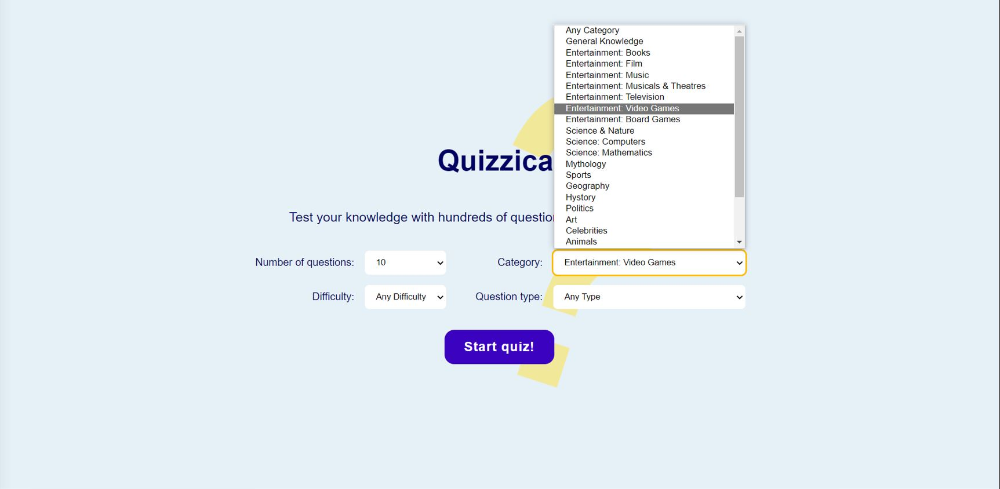
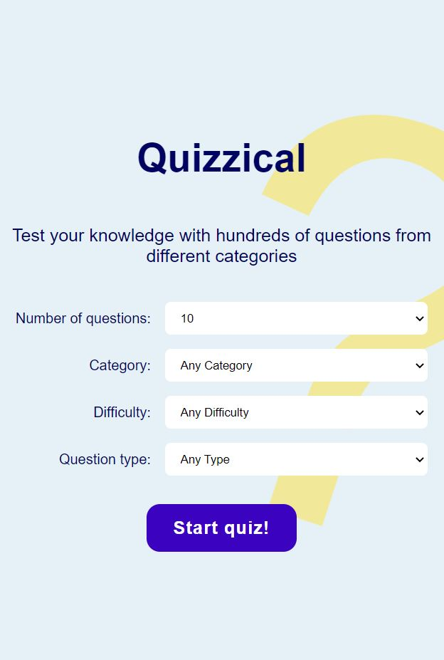
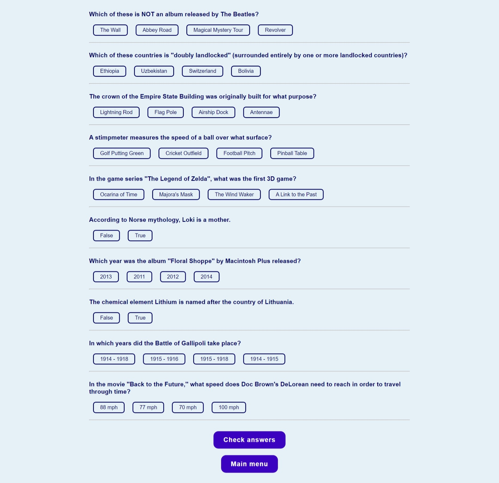
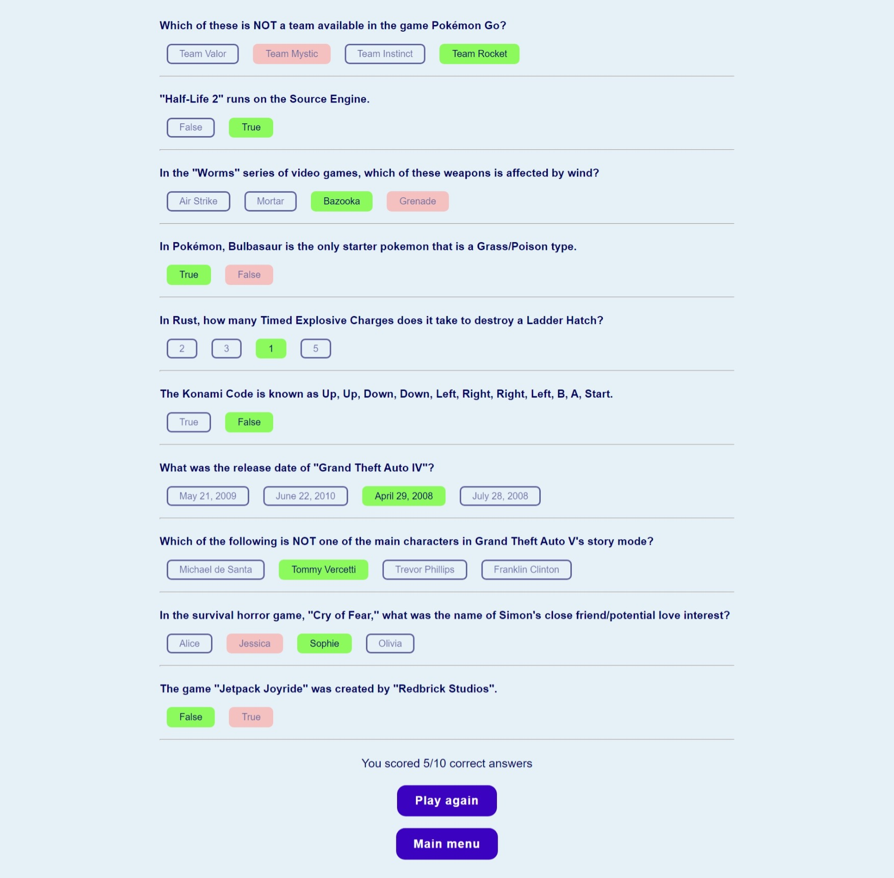

# Quizzical

Test your knowledge with hundreds of questions from different categories

Quizzical is a trivia game where the user has the possibility to configure the game settings according to their preferences.
The player has to answer all the questions and then the game shows how many correct answers the user has marked.

*API available at: https://opentdb.com/

img1 and img2 show the main menu where the player can customize the game settings

img3 shows the game interface, where the user has to answer questions

img4 shows the results screen where the player can see the correct answers in green and the incorrect answers they selected in red

